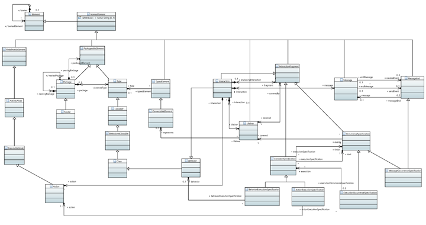
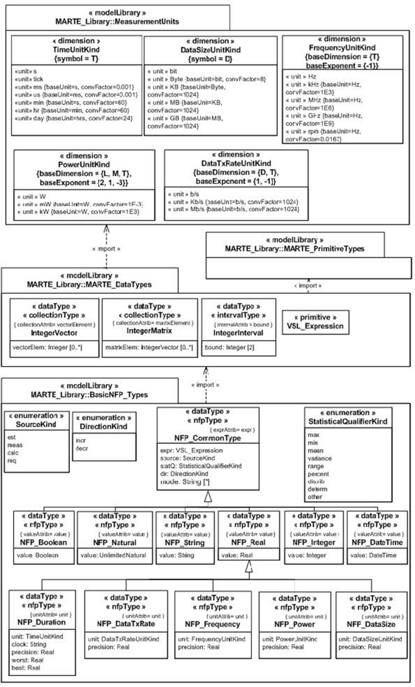

# es.unizar.disco.pnml.m2m

## Notes about this document

This document describes the elements that may be used to model activity diagrams and sequence diagrams in the context of DICE.
Models created according to this guide are aimed to be transformed within the DICE IDE to an underlying formalism, such as Petri nets.

Parts of this text may describe usages that are more restricted than the normative specification.

Parts on this text that are ~~striked out~~ describe normative usages specified in their corresponding standards ([UML](http://www.omg.org/spec/UML/2.5/), [MARTE](http://www.omg.org/spec/MARTE/1.1)) that are not implemented or are not guaranteed to work properly.
We highlight these unimplemented parts of the standard since their use may lead to unexpected behavior of the DICE transformations. 

## UML Activity Diagram to PNML

The following list summarizes the main elements that can be used in a UML Activity Diagram and that will be treated by the DICE *UML Activity Diagram to PNML* transformation:

* **`UML::Packages::Model`**: A `Model` captures a view of a physical system. It is an abstraction of the physical system, with a certain purpose.
* **`UML::Activities::Activity`**: An `Activity` is the specification of parameterized behavior as the coordinated sequencing of subordinate units (`ActivityNodes`).
* **`UML::Activities::ActivityNode`** (abstract): `ActivityNode` is an abstract class for points in the flow of an `Activity` connected by `ActivityEdges`.
* **`UML::Activities::ActivityEdge`** (abstract): An `ActivityEdge` is an abstract class for directed connections (i.e., with `source` [1..1] and `target` [1..1]) between two `ActivityNodes`.
* **`UML::Activities::ControlFlow`**: A `ControlFlow` is an `ActivityEdge` traversed by control tokens or object tokens of control type, which are used to control the execution of `ExecutableNodes`.
* **`UML::Activities::ControlNode`** (abstract): A `ControlNode` is an abstract `ActivityNode` that coordinates flows in an `Activity`.
* **`UML::Activities::InitialNode`**: An `InitialNode` is a `ControlNode` that offers a single control token when initially enabled.
* **`UML::Activities::FinalNode`** (abstract): A `FinalNode` is an abstract `ControlNode` at which a flow in an `Activity` stops.
* **`UML::Activities::ActivityFinalNode`**: `An ActivityFinalNode` is a `FinalNode` that terminates the execution of its owning `Activity` [...].
* **`UML::Activities::ForkNode`**: A `ForkNode` is a `ControlNode` that splits a flow into multiple concurrent flows.
* **`UML::Activities::JoinNode`**: A `JoinNode` is a `ControlNode` that synchronizes multiple flows.
* **`UML::Activities::DecissionNode`**: `DecisionNode` is a `ControlNode` that chooses between outgoing `ActivityEdges` for the routing of tokens.
* **`UML::Activities::MergeNode`**: A `MergeNode` is a `ControlNode` that brings together multiple alternate flows. It is not used to synchronize concurrent flows but to accept one among several alternate flows. 
* **`UML::Actions::Action`** (abstract): An `Action` is the fundamental unit of executable functionality. The execution of an `Action` represents some transformation or processing in the modeled system. `Actions` provide the `ExecutableNodes` within `Activities` and may also be used within `Interactions`.
* **`UML::Actions::OpaqueAction`**: An `OpaqueAction` is an `Action` whose functionality is not specified within UML.


<p align="center">
<a href="doc/images/uml_ad4200.png">

</a> 
</p>


## Sequence diagram to PNML (Work in progress)

* **`UML::Packages::Model`**: A `Model` captures a view of a physical system. It is an abstraction of the physical system, with a certain purpose.
* **`UML::Interactions::Interaction`**: `Interactions` are units of behavior, and focus on the passing of information with `Messages` between the `ConnectableElements`. `Interactions` are the top-level elements of a UML sequence diagram. 
* **`UML::Interaction::Lifeline`**: A `Lifeline` represents an individual participant in the `Interaction`. `Lifelines` represent only one interacting entity (via the `represents` association to `ConnectableElement`).
* **`UML::Interactions::InteractionFragment`** (abstract): `InteractionFragment` is an abstract notion of the most general interaction unit. An `InteractionFragment` is a piece of an `Interaction`. Each `InteractionFragment` is conceptually like an `Interaction` by itself. `InteractionFragments` are the main constituent parts of an `Interaction`. An `InteractionFragment` may either be contained directly in an enclosing `Interaction`~~, or may be contained within an `InteractionOperand` of a `CombinedFragment`. As a `CombinedFragment` is itself an `InteractionFragment`, there may be multiple nesting levels of `InteractionFragments` within an `Interaction`~~.
* **`UML::Interactions::ExecutionSpecification`** (abstract): An `ExecutionSpecification` is a specification of the execution of a unit of `Behavior` or `Action` within the `Lifeline`. The duration of an `ExecutionSpecification` is represented by two `OccurrenceSpecifications`, the `start` `OccurrenceSpecification` and the `finish` `OccurrenceSpecification`.
* **`UML::Interactions::OccurrenceSpecification`**: An `OccurrenceSpecification` is the basic semantic unit of `Interactions`. The sequences of occurrences specified by them are the meanings of `Interactions`.
* **`UML::Interactions::ExecutionOccurrenceSpecification`**: An `ExecutionOccurrenceSpecification` represents moments in time at which `Actions` or `Behaviors` start or finish.
* **`UML::Interactions::MessageOccurrenceSpecification`**: A `MessageOccurrenceSpecification` specifies the occurrence of `Message` events. A `MessageOccurrenceSpecification` is a kind of `MessageEnd`. `Messages` are generated either by synchronous `Operation` calls or asynchronous `Signal` sends. 
* **`UML::Interactions::MessageEnd`**: `MessageEnd` is an abstract specialization of `NamedElement` that represents what can occur at the end of a `Message`.

<p align="center">
<a href="doc/images/uml_sd4200.png">

</a> 
</p>

## Applicable stereotypes

### `MARTE::MARTE_AnalysisModel::GQAM::GaAnalysisContext`

For a given analysis, the context identifies the model elements (diagrams) of interest and specifies global parameters of the analysis.

* **Applicable to** : 
	* `UML::Classifiers::NamedElement` (from `ExpressionContext` supertype)
* **In DICE, applied to**:
	* `UML::Activities::Activity` (as a specialization of `UML::Classifiers::NamedElement`).
	* `UML::Interactions::Interaction` (as a specialization of `UML::Classifiers::NamedElement`).
* **Tagged values of interest**:
	* `contextParams` (implemented as `context` in Papyrus MARTE): NFP_String [*]
	  Strings giving a set of annotation variables defining global properties of this analysis context. ~~Each string should conform to the concrete syntax for variable calls or declarations as defined in B.3.3.12 of the MARTE standard.~~
	  
	  Only variable names that must match the following structure are supported: 
```
identifier ::=  ("$") (letter|"_") (letter | digit | "_")*
```
	
Example:

	context = [ $rt, $njobs, $p1, $t1 ]


### `MARTE::MARTE_AnalysisModel::GQAM::GaScenario`

A Scenario (`GaScenario`) captures system-level behavior and attaches allocations and resource usages to it.
It is composed of suboperations called *Steps* (`GaStep`)~~, any one of which can be a composite *Step*, refined as another *Scenario*~~.

* **Applicable to** : 
	* `UML::Classifiers::NamedElement` (from `ResourceUsage` supertype)
	* `UML::Actions::Action` (from `TimedProcessing` supertype)
	* `UML::CommonBehaviors::Behavior` (from `TimedProcessing` supertype)
	* `UML::Interactions::Message` (from `TimedProcessing` supertype)
* **In DICE, applied to**:
	* `UML::Activities::Activity` (as a specialization of `UML::Classifiers::NamedElement`).
	* `UML::Interactions::Interaction` (as a specialization of `UML::Classifiers::NamedElement`).
* **Tagged values of interest**:
	* `throughput`: `MARTE_Library::Basic_NFP_Types::NFP_Frequency`
	* `respT`: `MARTE_Library::Basic_NFP_Types::NFP_Duration`
	* `utilization`: `MARTE_Library::Basic_NFP_Types::NFP_Real`

Example:

	respT = (expr = $rt, unit = s, statQ = mean, source = calc)

### `MARTE::MARTE_AnalysisModel::GQAM::GaWorkloadEvent`

A stream of events that initiate system-level behavior. 
It may be generated in different ways: by a stated arrival process (such as Poisson or deterministic), 
by an arrival-generating mechanism modeled by a workload generator class, by a timed event and from a trace.

* **Applicable to** : 
	* `UML::Classes::Kernel::NamedElement`.
* **In DICE, applied to**:
	* `UML::InitialNode`.
* **Tagged values**:
	* `pattern`: `MARTE::MARTE_Library::BasicNFP_Types::ArrivalPattern`
	  Pattern of arrival events.
		* `closed`: It describes a workload characterized by a fixed number of active or potential users or jobs that cycle between executing the scenario.
		  This pattern makes the transformation produce a closed Petri net that is analysed in steady state.
			* `population`: NFP_Integer
			  Size of the workload. This property is required for the automatic analysis of the net, and denotes the initial marking of the place corresponding to this `InitialNode`.
	    * *empty* (`null`): This pattern creates an open Petri net, with initial and final places and no initial marking. This net is unuseful for automatic analysis, and as such, will throw an error in automated environments.   
		* ~~`open`: This pattern may produce an open Petri net for transient analysis with initial and final transitions that produce and consume tokens. The exact transformation that generates a Petri net from this pattern is not defined yet.~~  
		* ~~`periodic`, `aperiodic`, `sporadic`, `burst`, `irregular`~~
	* ~~`generator`:~~
	* ~~`trace`:~~
	* ~~`timeEvent`:~~  
  
Example:

A valid `GaWorkloadEvent` denoting an initial marking of $njobs is typically declared as follows: 

	pattern = (closed = (population = (expr = $njobs)))

### `MARTE::MARTE_AnalysisModel::GQAM::GaStep` extends `MARTE::MARTE_AnalysisModel::GQAM::GaScenario` 

A `GaStep` is a part of a `Scenario`, defined in sequence with other actions~~, and may be a composite Step containing a Scenario~~.

* **Applicable to** : 
	* `UML::Classifiers::NamedElement` (from `GaScenario`)
	* `UML::Actions::Action` (from `GaScenario`)
	* `UML::CommonBehaviors::Behavior` (from `GaScenario`)
	* `UML::Interactions::Message` (from `GaScenario`)
* **In DICE, applied to**:
	* `UML::Action::Action` using the `throughput`, `respT` or `utilization` tagged values to calculate the metric on this `Action` 
	* `UML::Action::Action` using the `hostDemand` tagged value to specify its mean execution time.
	* `UML::Activities::ControlFlow` (as a specialization of `UML::Classifiers::NamedElement`) using the `prob` tagged value to specify the probability of the execution path after a `ChoiceNode`.
	* `UML::Interactions::Message` using the 
* **Tagged values of interest**:
	* `hostDemand`: `MARTE_Library::Basic_NFP_Types::NFP_Duration`
	  The cpu demand in units of operations, if all Steps are on the same host.
	* `prob`: `MARTE_Library::Basic_NFP_Types::NFP_Real` [0..1] = 1
	  The probability of the step to be executed (for a conditional execution).

Examples:

* The following `hostDemand` declarations can be applied to an `Action` to specify that the mean execution time is `2 seconds`. 

	```
	hostDemand = (value = 2, unit = s)
	```
	```	
	hostDemand = (value = 2, unit = s, statQ = mean)
	```

* The following `hostDemand` declaration can be applied to an `Action` to specify that the mean execution time is `$t1 seconds`. 

	```
	hostDemand = (expr = $t1, unit = s)
	```

* The following `hostDemand` declaration can be applied to a `ControlFlow` to specify that the the probability of this alternative path is `$p1`. 
	
	```
	prob = (expr = $p1)
	```


##  Appendix A. Summary of MARTE NFPs Types

### Enumeration types

#### `MARTE_Library::BasicNFP_Types::SourceKind`

Literals: `est` (estimated), `req` (required), `meas` (measured), `calc` (calculated).

#### `MARTE_Library::BasicNFP_Types::StatisticalQualifierKind`

Literals: `max` (maximum), `min` (minimum), `mean` (mean), `variance` (variance), `range` (range), `percent` (percentile), `distrib` (distribution), `determ` (deterministic), `other` (other).

#### `MARTE_Library::MeasurementUnits::TimeUnitKind`

Literals: `tick` (ticks), `s` (seconds), `ms` (miliseconds), `us` (microseconds), `min` (minutes), `hr` (hours), `day` (days).

#### `MARTE_Library::MeasurementUnits::FrequencyUnitKind`

Literals: `Hz`, `kHz`, `MHz`, `GHz`, `rpm`


### NFP Datatypes

#### `MARTE_Library::BasicNFP_Types::NFP_CommonType`

* `expr`: VSL_Expression [0..1] 
  A VSL expression.
	* Only arithmetic expressions involving basic types and variables are supported.
	* Expressions must be evaluatable to a basic type (e.g., Integer, Real, etc.). 
* `source`: SourceKind [0..1]
    * *empty* (`null`): The value (either the value of the `expr` expression or the `value` of a subtype) should be treated as an input value for the simulation (e.g. `est`).  
	* `est`: The value (either the value of the `expr` expression or the `value` of a subtype) should be treated as an input value for the simulation.
	* `req`: The property is a requirement and should be calculated as an output parameter. The obtained value must be compared with the value specified in the model (either the `value` or the `expr` expression). 
	* `meas`: The value, that has been obtained from a measure of a real execution of the system, should be treated as an input value for the simulation.
	* `calc`: The property should be calculated and considered as an output parameter
* `statQ`: StatisticalQualifierKind [0..1]
    * *empty* (`null`): The value of the property is the mean value.
    * `mean`: The value of the property is the mean value.
    * ~~`max` , `min` , `mean`, `variance`, `range`, `percent`, `distrib`, `determ`, `other`~~
* ~~`dir`: DirectionKind [0..1]~~
* ~~`mode`: String[*]~~
	
#### `MARTE_Library::BasicNFP_Types::NFP_Integer` extends `MARTE_Library::BasicNFP_Types::NFP_CommonType`

* `value`: Integer [0..1]
	* If `value` is *empty*, an `expr` expression must be defined.
	* If `value` is not *empty*, `expr` must be *empty*. 

#### `MARTE_Library::BasicNFP_Types::NFP_Real` extends `MARTE_Library::BasicNFP_Types::NFP_CommonType`

* `value`: Real [0..1]
	* If `value` is *empty*, an `expr` expression must be defined.
	* If `value` is not *empty*, `expr` must be *empty*. 

#### `MARTE_Library::BasicNFP_Types::NFP_Duration` extends `MARTE_Library::BasicNFP_Types::NFP_Real`

* `unit`: TimeUnitKind [0..1]
  Attribute representing the measurement unit.
    * *empty* (`null`): The value (either the `value` or the value of the `expr`) is expressed in `s` (seconds).  
	* `s`: The property is expressed in seconds.
	* ~~`tick`, `ms`, `us`, `min`, `hr`, `day`~~.
* ~~`clock`: String [0..1]~~
* ~~`precision`: Real [0..1]~~
* ~~`worst`: Real [0..1]~~
* ~~`best`: Real [0..1]~~

#### `MARTE_Library::BasicNFP_Types::NFP_Frequency`

* `unit`: FrequencyUnitKind [0..1]
  Attribute representing the frequency unit.
    * *empty* (`null`): The value (either the `value` or the value of the `expr`) is expressed in `Hz`.  
	* `Hz`: The property is expressed in Hertz (number of cycles -i.e. processed jobs- per unit time -seconds-).
	* ~~`kHz`, `MHz`, `GHz`, `rpm`~~.
* ~~`precision`: Real [0..1]~~


#### `MARTE_Library::BasicNFP_Types::ArrivalPattern`
* `closed`: ClosedPattern [0..1]
  It describes a workload characterized by a fixed number of active or potential users or jobs that cycle between executing the scenario.
* ~~`open`: OpenPattern [0..1]~~
* ~~`periodic`: PeriodicPattern [0..1]~~
* ~~`aperiodic`: AperiodicPattern [0..1]~~
* ~~`sporadic`: SporadicPattern [0..1]~~
* ~~`burst`: BurstPattern [0..1]~~
* ~~`irregular`: IrregularPattern [0..1]~~

#### `MARTE_Library::BasicNFP_Types::ClosedPattern`

* `population`: NFP_Integer [0..1]
  The size of the workload (number of system users).
* ~~`extDelay`: NFP_Duration [0..1]~~

<p align="center">
<a href="doc/images/marte_nfps_a.jpg">

</a> 
<a href="doc/images/marte_nfps_b.jpg">

</a> 
</p>

##  Appendix B. Cheatsheet

Stereotype          | Tagged value                                               | IN/OUT | Applies to    | Goal                                                                           | Example
------------------- | ---------------------------------------------------------- |:------:| ------------- | ------------------------------------------------------------------------------ | -------
`GaAnalysisContext` | `context`                                                  | IN     | `Activity`    | Used to specify the variables that may be used in this scenario                | `context = [ $rt, $njobs, $t1, $p1 ]`
`GaScenario`        | `respT` / `throughput` / `utilization`                     | OUT    | `Activity`    | Used to specify the metrics to be calculated on this `GaScenario`              | `respT = (expr = $rt, unit = s, statQ = mean, source = calc)`
`GaWorkloadEvent`   | `pattern`                                                  | IN     | `InitialNode` | Used to define the initial workload (users, jobs, etc.) of the initial node(s) | `pattern = (closed = (population = (value = 5)))` <br> `pattern = (closed = (population = (expr = $njobs)))`
`GaStep`            | `hostDemand`                                               | IN     | `Action`      | Used to define the mean execution time of the `Action`                         | `hostDemand = (value = 2, unit = s)` <br> `hostDemand = (expr = $t1, unit = s)`
`GaStep`            | `respT` / `throughput` / `utilization` (from `GaScenario`) | OUT    | `Action`      | Used to specify the metrics to be calculated on this `Action`                  | `respT = (expr = $rt, unit = s, statQ = mean, source = calc)`
`GaStep`            | `prob`                                                     | IN     | `ControlFlow` | Used to specify the probability of the execution paths leaving a `ChoiceNode`  | `prob = (value = 0.8)` <br> `prob = (expr = $p1)`


